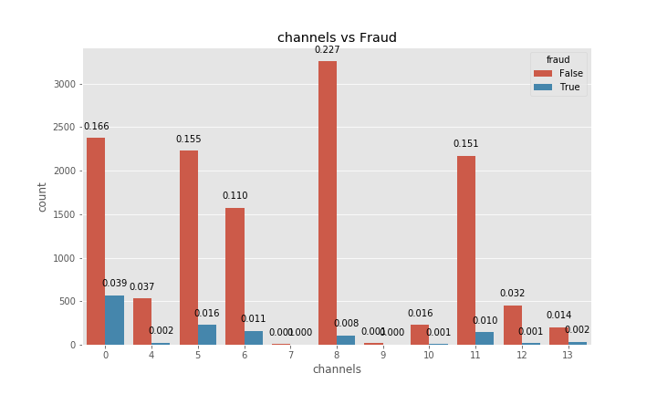
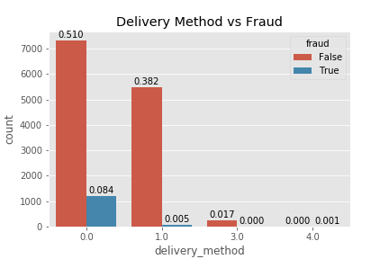
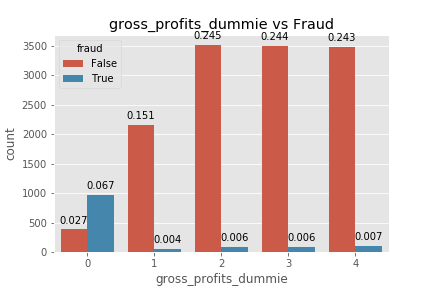
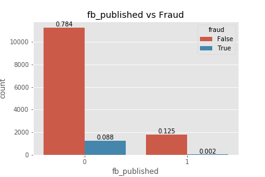
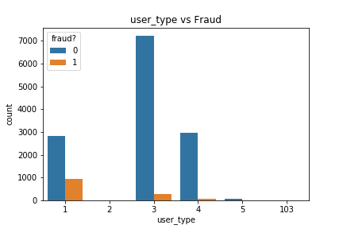
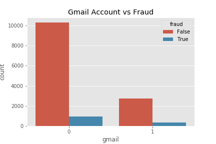
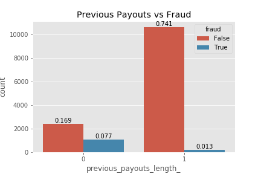

<!--  -->

# Fraud Case Study

|Team Shut the FRAUD Down!!|
|---|
[Tyler Woods](https://github.com/tylerjwoods)  | 
|[Cindy Wong](https://github.com/cwong690) |
|[Ben Weintraub](https://github.com/b-weintraub)|

## Overview

This is a Flask based web app that streams events and automatically detects fraudulent events. 

Due to privacy, the data and website are not available but the pickled model and code is.

## Data Preparation

### EDA

Fraudelent categories

   Channels vs Fraud       |  Delivery Method vs Fraud |     Gross Profits vs Fraud
:-------------------------:|:-------------------------:|:-------------------------:
 |   |    

   FB Published vs Fraud   |  Ticket Length vs Fraud   |     User Type vs Fraud
:-------------------------:|:-------------------------:|:-------------------------:
|   |    

   Sale Duration vs Fraud  |  Gmail vs Fraud           |     Previous Payout vs Fraud
:-------------------------:|:-------------------------:|:-------------------------:
|   |    

## Models

## Future Work

- [ ] KNN
- [ ] Better Model
- [ ] Clean up files