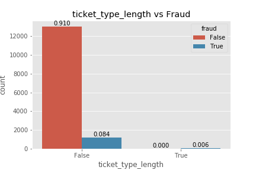

<!--  -->

# Shut the FRAUD Down!

### A fraud detection model with an interactive Flask app to stream events and automatically detect fraudulent cases!

<a href="https://github.com/b-weintraub">Ben Weintraub</a> | <a href="https://github.com/cwong90">Cindy Wong</a> | <a href="https://github.com/tylerjwoods">Tyler Woods</a>

## Table of Contents

- [Overview](#overview)
- [Data Preparation](#data-preparation)
    - [EDA](#eda)
- [Models](#models)
- [Fraudulent Activity Detector](#fraudulent)
- [Future Work](#future-work)

## Overview

<b>Premise:</b>
A new e-commerce site needs a data scientist to detect fraudsters. A machine learning model needs to be created. However, failures are not equal. False positives will decrease trust with consumers and false negatives will cost money.

The model does not predict a ground truth, but rather flags ones that have high potential.
The interactive portion of the web app allows users to see which cases are the top priorities to check and attributes about that case.

## Data Preparation

  
<b> Dataset </b>

  
    
   
  
 Quick statistics of the columns 

    

### EDA

We started off with a heatmap of correlation between the target value (fraud or not fraud) and all the other columns.

There appears to be columns that have higher correlations to being fraud. The bar plots below will show the number of fraudulent for different values within each category. For example, the higher the delivery method number, the less likely it is a fraudelent case.

   Channels vs Fraud       |  Delivery Method vs Fraud |     Gross Profits vs Fraud
:-------------------------:|:-------------------------:|:-------------------------:
 |   |    

   FB Published vs Fraud   |  Ticket Length vs Fraud   |     User Type vs Fraud
:-------------------------:|:-------------------------:|:-------------------------:
|   |    

   Sale Duration vs Fraud  |  Gmail vs Fraud           |     Previous Payout vs Fraud
:-------------------------:|:-------------------------:|:-------------------------:
|   |    

## Models

Using Random Forest, feature importance were revealed:

 

 3 separate models were built in order to determine the best one for this problem. Below are the ROC curves for each model.

 
    

    
Logistic Regression

    

   

    
Random Forest Classifier

    

    
Gradient Boosting

    

### Combined ROC Curves Comparison

## Fraudulent Activity Detector

The model and the data are store in MongoDB and connected through PyMongo. Below is an example of a piece of data, stored in dictionary form, inserted into MongoDB:

The Fraudulent Activity Detector allows clients to quickly the latest records and the prediction of risk level for each case. There are 4 levels of fraudulent cases: low risk, medium risk, high risk, and unable to predict risk.

The chart below is an easy visualization of how many cases are in each category. It is highly suggested for the cases that are unabled to receive a prediction to be checked by an employee as well as the high risk cases.

Descriptions of the events are recorded as well in order to track down any leads.

## Future Work

- [ ] KNN
- [ ] Better Model
- [ ] Clean up files